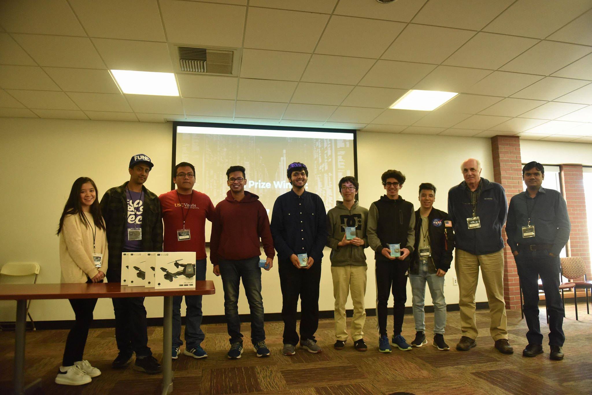

# IoT Take On Improving Residential Security
Using fast, highly secure IoT technology to making sure our residence is safe at an affordable price. Project completed at HackIoT at University of Southern California. <b>Received 2nd prize</b> in the hackathon.

More in-depth details on <b>https://devpost.com/software/homesafehome</b>.

  

Contributors:
  1. [Manik Narang](http://maniknarang.me)
  2. [Kaustubh Lall](https://devpost.com/klall)
  3. [Curtis Lee](https://devpost.com/curtisrlee)
  4. [Sneheil Saxena](https://devpost.com/sneheilsaxena)
